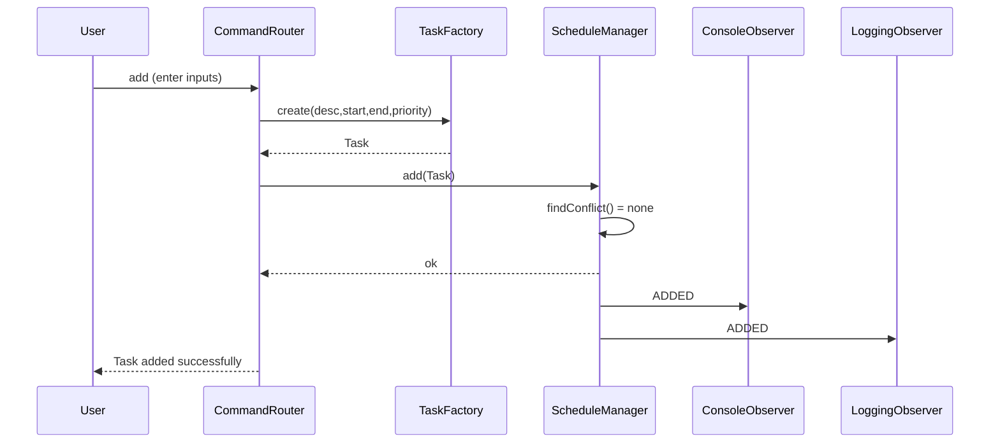
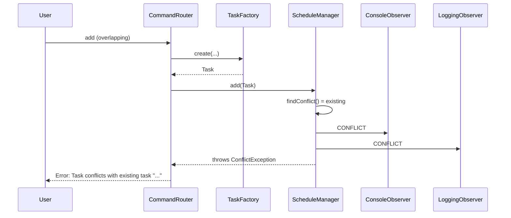

# Astronaut Daily Schedule Organizer (Java)

A clean, console-based Java 17 application that helps astronauts organize their daily schedule using best practices and GoF patterns:
- Singleton — single `ScheduleManager` instance for all task operations
- Factory — `TaskFactory` to construct and validate `Task` objects
- Observer — observers notified on add/remove/update/complete/conflict events

## How to Run
1) Build (Maven Wrapper included; Maven install not required)
- Windows (PowerShell/CMD):
```
./mvnw.cmd -q -DskipTests package
```
- macOS/Linux:
```
./mvnw -q -DskipTests package
```

2) Run
```
java -jar target/astronaut-schedule-console-1.0.0.jar
```

## Commands
- `help` — List commands
- `add` — Add a new task
- `remove` — Remove a task by description
- `view` — View all tasks sorted by start time
- `viewp` — View tasks by priority (HIGH/MEDIUM/LOW)
- `edit` — Edit an existing task
- `complete` — Mark a task as completed
- `clear` — Clear the console
- `exit` — Quit the application

## Input Guide & Examples
Times use 24-hr `HH:mm` format.

- `add`
  - Description: Morning Exercise
  - Start time (HH:mm): 07:00
  - End time (HH:mm): 08:00
  - Priority (High/Medium/Low): High
  - Output: `Task added successfully. No conflicts.`

- `view`
  - Output (example):
    - `07:00 - 08:00: Morning Exercise [HIGH]`
    - `09:00 - 10:00: Team Meeting [MEDIUM]`

- `remove`
  - Description of task to remove: Morning Exercise
  - Output: `Task removed successfully.`

- `edit`
  - Existing description: Team Meeting
  - New description (blank=keep): Daily Sync
  - New start (HH:mm, blank=keep): 09:00
  - New end (HH:mm, blank=keep): 10:00
  - New priority (High/Medium/Low, blank=keep): Medium
  - Output: `Task updated: 09:00 - 10:00: Daily Sync [MEDIUM]`

- `complete`
  - Description: Daily Sync
  - Output: `Task marked completed.`

- `viewp`
  - Priority (High/Medium/Low): High
  - Output: shows only tasks with `HIGH` priority or says `No tasks for priority HIGH.`

## Validations & Errors
- Overlap detection prevents adding/editing tasks that overlap an existing task.
  - Example: Adding `09:30-10:30` when `09:00-10:00` exists results in:
    - `Error: Task conflicts with existing task "Team Meeting"`
- Invalid time format (e.g., `25:00`) results in:
  - `Error: Invalid time format. Expected HH:mm`
- Removing a non-existent task results in:
  - `Error: Task not found`
- Adding a task with the same description as an existing one results in:
  - `Error: Task with this description already exists`

## Design & Patterns
- `com.kirthick.astro.schedule.manager.ScheduleManager` — Singleton manager; maintains tasks; operations are synchronized for safety; publishes `ScheduleEvent`s to observers.
- `com.kirthick.astro.schedule.factory.TaskFactory` — Centralizes `Task` creation, parsing, and validation.
- `com.kirthick.astro.schedule.observer.*` — `ConsoleObserver` (user-facing notices) and `LoggingObserver` (logs all events).
- `com.kirthick.astro.schedule.domain.*` — Immutable `Task` model with `Priority`; `Task#toString()` prints a human-readable line (`HH:mm - HH:mm: description [PRIORITY, Completed]`).
- `com.kirthick.astro.app.*` — Console loop, routing, and command handlers with friendly prompts and defensive programming.

## Notes
- Logs are written to `logs/app.log`.
- The loop avoids `while(true)` and uses a stream-driven prompt with clean exit on `exit`.
- The app prints friendly messages and validates input at boundaries.
- Observer notifies about conflicts proactively (console notice + logged warning).

## Detailed Description

### What this app does
- **[organize-daily-tasks]**: Lets an astronaut maintain a day’s schedule with tasks containing description, start/end times, and priority.
- **[safe-CRUD]**: Supports add, remove, edit, complete, view, and view-by-priority with strong input validation and clear error messages.
- **[no-overlaps]**: Prevents overlapping tasks; emits observer notifications on conflicts or updates.

### Architecture overview
- **[console layer]**: `com.kirthick.astro.app/` contains `Main`, `ConsoleIO`, `CommandLoop`, and `CommandRouter` for I/O, routing, and command workflows.
- **[domain layer]**: `com.kirthick.astro.schedule.domain/` contains immutable `Task` and `Priority`.
- **[patterns]**:
  - Singleton: `ScheduleManager` as the single in-memory schedule service.
  - Factory: `TaskFactory` centralizes creation and input parsing.
  - Observer: `ScheduleObserver` + `ConsoleObserver` + `LoggingObserver` for event notifications.
- **[infra/common]**: `com.kirthick.astro.common/` provides `Validation` and exceptions; logging configured via `logback.xml`.

### Data model and invariants
- **Task** fields: `description` (String), `start` (LocalTime), `end` (LocalTime), `priority` (enum), `completed` (boolean).
- **Invariants**:
  - Description is non-blank and unique (case-insensitive) across the day.
  - `start < end` enforced at construction.
  - Time format is 24-hr `HH:mm` and validated by `TaskFactory.parseTime()`.

### Conflict detection logic
- **Overlap rule**: intervals `[a.start, a.end)` and `[b.start, b.end)` overlap when `a.start < b.end && b.start < a.end`.
- **Where used**: on `add()` and `edit()` in `ScheduleManager` before persisting.
- **Complexity**: O(n) scan over current tasks. This is acceptable for a daily schedule (typically small). If needed, the manager can be refactored to a start-time ordered `TreeMap` or interval tree.

### Observers and notifications
- **Events**: `ADDED`, `REMOVED`, `UPDATED`, `COMPLETED`, `CONFLICT` represented by `ScheduleEventType` and `ScheduleEvent`.
- **Who listens**:
  - `ConsoleObserver`: prints concise user notices for conflicts.
  - `LoggingObserver`: logs all events with context for auditing.
- **When fired**: After successful operations; on conflict, emitted prior to raising a `ConflictException`.

### Thread-safety and consistency
- `ScheduleManager` uses the holder idiom Singleton and synchronizes mutating operations to keep state consistent.
- Backing store is a `ConcurrentHashMap` keyed by normalized (lower-case) description; observers use `CopyOnWriteArrayList` for safe iteration.
- Idempotency: `complete` is idempotent; repeated calls keep the task completed without error.

### Performance considerations
- View operations sort by start time using streams. For typical daily schedules this is efficient and clear.
- Keys are normalized once per operation to avoid case-mismatch errors and make lookups O(1).
- Logging is INFO by default; DEBUG can be enabled via `logback.xml` if deeper traces are needed.

### Extensibility
- **Dates**: Currently one in-memory day. Extend `Task` with a date or `LocalDateTime` and partition schedules per date.
- **Persistence**: Swap the `Map` with a repository (file/DB) behind an interface to persist across sessions.
- **Recurring tasks**: Add recurrence rules and an expansion layer to generate instances.
- **IDs**: Introduce stable task IDs (UUID) alongside descriptions to support renames without re-keying.
- **CLI flags**: Add `--import`/`--export` for JSON/CSV to batch load or save schedules.

### Error handling and messages
- Human-friendly errors for invalid times, duplicates, not found, and overlaps.
- Defensive programming at boundaries (`Validation.require*`), consistent error strings, and logging context.

### Why these patterns here
- **Singleton**: Exactly one authoritative schedule manager per process; centralizes constraints and avoids accidental divergent states.
- **Factory**: Consolidates parsing and validation, ensuring all tasks are constructed correctly and error messages are consistent.
- **Observer**: Decouples user-facing messages and logging from core logic, making side effects composable without entangling the manager.

## Command Reference (inputs, validations, typical errors)

- **add**
  - Prompts: `Description`, `Start time (HH:mm)`, `End time (HH:mm)`, `Priority (High/Medium/Low)`
  - Validations: non-blank description; time format; start < end; unique description; no overlap
  - Errors: `Invalid time format. Expected HH:mm`, `Task conflicts with existing task "..."`, `Task with this description already exists`

- **remove**
  - Prompts: `Description of task to remove`
  - Validations: must exist
  - Errors: `Task not found`

- **view**
  - No prompts
  - Output: tasks sorted by start time or `No tasks scheduled for the day.`

- **viewp**
  - Prompts: `Priority (High/Medium/Low)`
  - Output: tasks filtered by priority or `No tasks for priority ...`

- **edit**
  - Prompts: `Existing description`, then new values (blank=keep)
  - Validations: existing must exist; any new times are validated; new description must be unique; no overlap in new window
  - Errors: `Task not found`, `Invalid time format...`, `Task with this description already exists`, `Task conflicts with existing task "..."`

- **complete**
  - Prompts: `Description`
  - Behavior: idempotent (completing twice is OK)
  - Errors: `Task not found`

## Validation Rules (summary)
- Description: non-blank, unique (case-insensitive)
- Time: `HH:mm` 24-hour; `start < end`
- Priority: `HIGH|MEDIUM|LOW` (case-insensitive)
- Overlap rule: `[new.start, new.end)` must not intersect any existing interval

## Conflict Examples
- Existing: `09:00-10:00 Team Meeting`
  - Add `09:30-10:30` → Conflict (overlap)
  - Add `10:00-11:00` → OK (touching end is not an overlap)
  - Add `08:00-09:00` → OK (touching start is not an overlap)
  - Add `08:30-09:30` → Conflict

## Observer Event Matrix
- `ADDED`: After a successful add, includes the created `Task`
- `REMOVED`: After a successful remove, includes the removed `Task`
- `UPDATED`: After a successful edit, includes the updated `Task`
- `COMPLETED`: After a successful complete, includes the updated `Task`
- `CONFLICT`: Before throwing a conflict error, includes the new `Task` and the conflicting existing `Task`

Subscribers:
- `ConsoleObserver`: prints a concise `[Notice]` only for conflicts
- `LoggingObserver`: logs all events at INFO (conflicts at WARN)

## SOLID Mapping
- **Single Responsibility**: Each class has a focused purpose (factory, manager, model, observers, console I/O).
- **Open/Closed**: New priorities or observers can be added without changing existing logic; factory can extend types.
- **Liskov Substitution**: Observers are interchangeable via `ScheduleObserver` interface.
- **Interface Segregation**: Minimal observer interface; console handlers are split by command.
- **Dependency Inversion**: High-level `ScheduleManager` depends on the `ScheduleObserver` abstraction, not concrete outputs.

## Assumptions & Limitations
- One in-memory day; no dates stored. Suitable for demo/exercise scope.
- Description acts as a unique key; consider introducing IDs for production.
- No persistence across runs; can add a repository layer for file/DB storage.
- Times assumed in astronaut’s local time and same day.

## Performance & Complexity
- Add/Edit/Remove: O(n) in worst case due to conflict scan; typical daily schedules keep n small.
- View sorted: O(n log n) for sorting by start time.
- Memory: O(n) tasks.

## Sample Session
```
astro> add
Description: Morning Exercise
Start time (HH:mm): 07:00
End time (HH:mm): 08:00
Priority (High/Medium/Low): High
Task added successfully. No conflicts.

astro> add
Description: Team Meeting
Start time (HH:mm): 09:00
End time (HH:mm): 10:00
Priority (High/Medium/Low): Medium
Task added successfully. No conflicts.

astro> add
Description: Training Session
Start time (HH:mm): 09:30
End time (HH:mm): 10:30
Priority (High/Medium/Low): High
[Notice] Task conflicts with existing task "Team Meeting"
Error: Task conflicts with existing task "Team Meeting"

astro> view
1. 07:00 - 08:00: Morning Exercise [HIGH]
2. 09:00 - 10:00: Team Meeting [MEDIUM]

astro> exit
```

## High-level Architecture (diagram)

```mermaid
graph TD
  U[User] -->|commands| R[CommandRouter]
  R --> M[ScheduleManager (Singleton)]
  R --> F[TaskFactory]
  F --> T[Task]
  M -->|events| O1[ConsoleObserver]
  M -->|events| O2[LoggingObserver]
  M --> S[(In-memory Store)]
```

## Flows (sequence diagrams)

### Add Task — success


### Add Task — conflict


## Configuration and Logging
- Config file: `src/main/resources/logback.xml`.
- Change log level by editing `<logger name="com.kirthick.astro" level="DEBUG"/>` or the `<root>` level.
- Logs are written to `logs/app.log` and rotate daily.

## Edge Cases to Try
- Same start and end time (e.g., `09:00`–`09:00`) → invalid (start must be before end).
- Overlapping by a single minute (e.g., `08:59`–`09:01` vs `09:00`–`10:00`) → conflict.
- Touching windows (`08:00`–`09:00` and `09:00`–`10:00`) → allowed, no conflict.
- Duplicate description differing only by case ("Meeting" vs "meeting") → considered duplicates.

